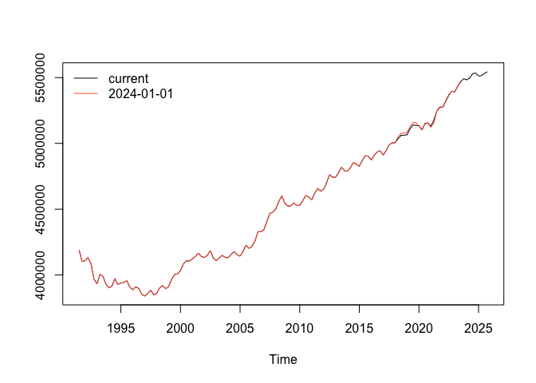

<!-- README.md is generated from README.Rmd. Please edit that file -->

# ch.fso.besta

[](https://github.com/opentsi/ch.fso.besta/actions/workflows/update_data.yaml)

The ch.fso.besta package provides versioned time series data and their
meta information for scientific research. In addition, the package
contains the extract-transform-load (ETL) functionality that sources the
data from its original provider.

## Browse Time Series Data

You can use GitHub’s ability to render to csv to explore the datasets

## Basic Data Consumption via opentimeseries

``` r
remotes::install_github("opentsi/opentimeseries")
library(opentimeseries)

# first param `series` defaults to NULL
# fetches all series from `remove_archive``
ts <- read_open_ts(
  remote_archive = "opentsi/ch.fso.besta" 
)

ts
```

``` r
library(opentimeseries)
library(tsbox)

# Load the historical data (added the missing comma after "coincident")
ts_old <- read_open_ts(
  series = "596.tot.tot",
  remote_archive = "opentsi/ch.fso.besta", # main series
  date = "2024-01-01"
)

# Load the current data (added the missing closing quote and comma)
ts_new <- read_open_ts(
  series = "596.tot.tot",
  remote_archive = "opentsi/ch.fso.besta"
)
# convert to date to plot
ts_new$date <- as.Date(ts_new$date)
ts_old$date <- as.Date(ts_old$date)

# Plot the time series
ts.plot(ts_ts(ts_new), ts_ts(ts_old),
        col = c("black", "tomato"))
#> [time]: 'date' 
#> [time]: 'date'


# Add the legend
legend("topleft", legend = c("current", "2024-01-01"),
       col = c("black", "tomato"), lty = 1, bty = "n")
```


